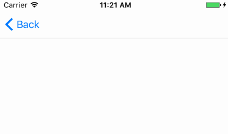
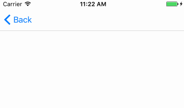

[](https://travis-ci.org/WXGBridgeQ/SwiftPullToRefresh)
[](https://github.com/Carthage/Carthage)
[](https://cocoapods.org/pods/SwiftPullToRefresh)
[](https://cocoapods.org/pods/SwiftPullToRefresh)
[](https://swift.org/)
[](https://github.com/WXGBridgeQ/SwiftPullToRefresh/blob/master/LICENSE)
[](https://codebeat.co/projects/github-com-wxgbridgeq-swiftpulltorefresh-master)

# SwiftPullToRefresh

An easy way to implement pull-down-to-refresh and pull-up-to-load-more feature based on UIScrollView extension, written in Swift 3.

Provide default style header and footer controls which you can directly use in your project, and also support for customization. GIF is also supported.

## Example usage

#### Indicator Header

```swift
scrollView.spr_setIndicatorHeader { [weak self] in
    // do your action here
    // self?.scrollView.spr_endRefreshing()
}
```


#### Text Header

```swift
scrollView.spr_setTextHeader { [weak self] in
    // do your action here
    // self?.scrollView.spr_endRefreshing()
}
```


#### Small GIF Header

```swift
scrollView.spr_setGIFHeader(data: data, isBig: false, height: 60) { [weak self] in
    // do your action here
    // self?.scrollView.spr_endRefreshing()
}
```


#### GIF + Text Header

```swift
scrollView.spr_setGIFTextHeader(data: data) { [weak self] in
    // do your action here
    // self?.scrollView.spr_endRefreshing()
}
```



#### Big GIF Header

```swift
scrollView.spr_setGIFHeader(data: data, isBig: true, height: 120) { [weak self] in
    // do your action here
    // self?.scrollView.spr_endRefreshing()
}
```


#### Indicator Footer

```swift
scrollView.spr_setIndicatorFooter { [weak self] in
    // do your action here
    // self?.scrollView.spr_endRefreshing()
}
```

or

```swift
scrollView.spr_setIndicatorAutoFooter { [weak self] in
    // do your action here
    // self?.scrollView.spr_endRefreshing()
}
```


#### Text Footer

```swift
scrollView.spr_setTextFooter { [weak self] in
    // do your action here
    // self?.scrollView.spr_endRefreshing()
}
```

or

```swift
scrollView.spr_setTextAutoFooter { [weak self] in
    // do your action here
    // self?.scrollView.spr_endRefreshing()
}
```


## Demo

Open and run the SwiftPullToRefreshDemo target in Xcode to see SwiftPullToRefresh in more actions.

## Requirements

* iOS 8.0
* Swift 3.0

## Installation

#### CocoaPods

```
use_frameworks!
pod 'SwiftPullToRefresh'
```

#### Carthage

```
github "WXGBridgeQ/SwiftPullToRefresh"
```

#### Manual

Add SwiftPullToRefresh folder into your project.

## Customization

The framework is very easy to customize the use.

You just need to subclass the `RefreshView` and implement the methods below, then call `spr_setCustomHeader(headerView:)` or `spr_setCustomFooter(footerView:)` with your scrollView.

```swift
class CustomHeaderOrFooter: RefreshView {
    override func didUpdateState(_ isRefreshing: Bool) {
        // customize your view display with refresh state here
    }
    
    override func didUpdateProgress(_ progress: CGFloat) {
        // customize your view display with progress here
    }
}
```

You can also check the code of the super cat refresh which is a custom header in the SwiftPullToRefreshDemo target (Inspired by [RayWenderlich](https://videos.raywenderlich.com/courses/68-scroll-view-school/lessons/18))



## Contribution

You are welcome to contribute to the project by forking the repo, modifying the code and opening issues or pull requests.

## License

Available under MIT license. See the [LICENSE](https://github.com/WXGBridgeQ/SwiftPullToRefresh/blob/master/LICENSE) for more info.