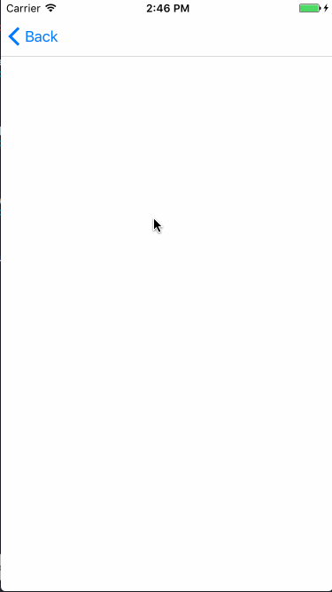
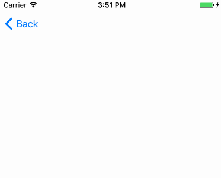
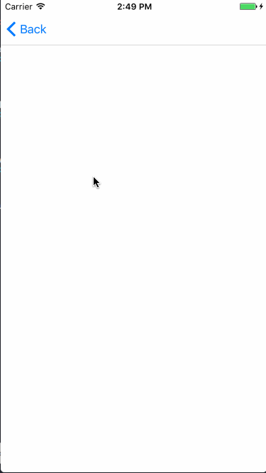
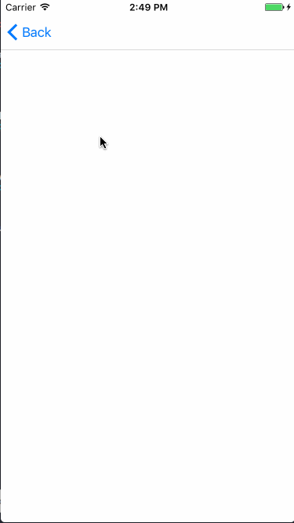

# SwiftPullToRefresh

An easy way to implement pull-to-refresh feature based on UIScrollView extension, written in Swift 3.

Supply default style refresh controls which you can directly use in your project, and also support for customization. GIF is also supported.

## Example usage

#### Arrow refresh

```swift
scrollView.spr_addArrowRefresh { [weak self] in
    // do your action here
    // self?.scrollView.spr_endRefreshing()
}
```



#### Text refresh

Text, font, color can be customized.

```swift
scrollView.spr_addTextRefresh { [weak self] in
    // do your action here
    // self?.scrollView.spr_endRefreshing()
}
```



#### GIF refresh

```swift
scrollView.spr_addGIFRefresh(data: data) { [weak self] in
    // do your action here
    // self?.scrollView.spr_endRefreshing()
}
```



#### Super cat refresh (Inspired by [RayWenderlich](https://videos.raywenderlich.com/courses/68-scroll-view-school/lessons/18))

```swift
scrollView.spr_addSuperCatRefresh(data: data) { [weak self] in
    // do your action here
    // self?.scrollView.spr_endRefreshing()
}
```



## Requirements

* iOS 8.0
* Swift 3.0

## Installation

#### CocoaPods

```
use_frameworks!
pod 'SwiftPullToRefresh'
```

#### Carthage

```
github "WXGBridgeQ/SwiftPullToRefresh"
```

#### Manual

Add SwiftPullToRefresh folder into your project.

## Customization

The framework is very easy to customize the use, you just need to subclass the `RefreshView` and implement two methods below:

```swift
class SomeCustomView: RefreshView {
    override func updateRefreshState(_ isRefreshing: Bool) {
        // customize your view display with refresh state here
    }
    
    override func updateProgress(_ progress: CGFloat) {
        // customize your view display with progress here
    }
}
```

## Contribution

You are welcome to contribute to the project by forking the repo, modifying the code and opening issues or pull requests.

## License

Available under MIT license. See the [LICENSE](https://github.com/WXGBridgeQ/SwiftPullToRefresh/blob/master/LICENSE) for more info.